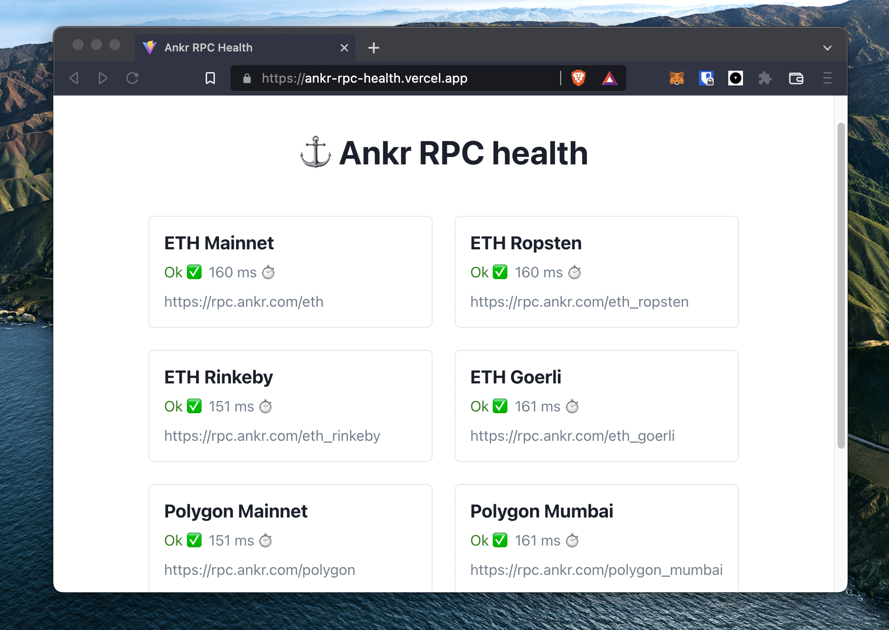

# ⚓️ Ankr RPC Health

A simple webpage that shows the status of different [public Ankr RPC endpoints](https://www.ankr.com/protocol/).



This page only supports EVM-based chains for now.

## ❓ How it works

The main health-checking logic lives in the [`useRpcHealth.ts`](src/hooks/useRpcHealth.ts) file. All it does is ping the `eth_blockNumber` endpoint on the RPC and checks if it gets a valid response.

```ts
const response = await fetch(rpcUrl, {
  body: [{ method: 'eth_blockNumber', id: 127, jsonrpc: '2.0' }],
  headers: {
    'Content-Type': 'application/json',
  },
  method: 'POST',
});
```

## ➕ Add a chain

A new chain (as long as it's EVM-based) can be easily added by adding an entry to the `rpcs` array in the [`utils.ts`](/src/utils.ts) file.
